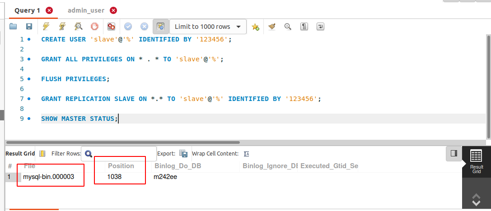
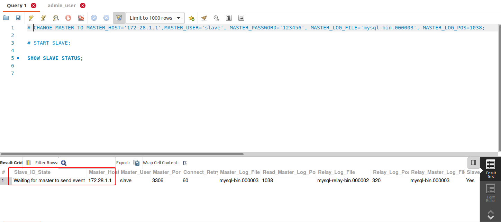

Docker MySQL master-slave replication 
========================

MySQL master-slave replication with using Docker. 

## Run

To run this examples you will need to start containers with "docker-compose" 
and after starting setup replication. See commands inside ./build.sh. 

#### Create 2 MySQL containers with master-slave row-based replication 

```
./build.sh
```

Please waiting for import databases.

# Master

CREATE USER 'slave'@'%' IDENTIFIED BY '123456';

GRANT ALL PRIVILEGES ON * . * TO 'slave'@'%';

FLUSH PRIVILEGES;

GRANT REPLICATION SLAVE ON *.* TO 'slave'@'%' IDENTIFIED BY '123456';

SHOW MASTER STATUS;



# Slave

CHANGE MASTER TO MASTER_HOST='172.28.1.1',MASTER_USER='slave', MASTER_PASSWORD='123456', MASTER_LOG_FILE='mysql-bin.000003', MASTER_LOG_POS=1038;

START SLAVE;

SHOW SLAVE STATUS;

